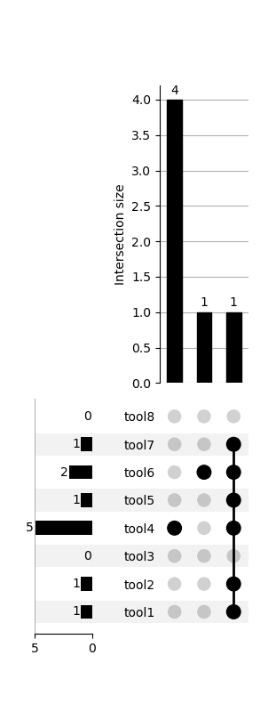
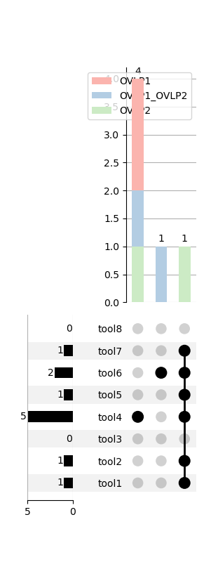
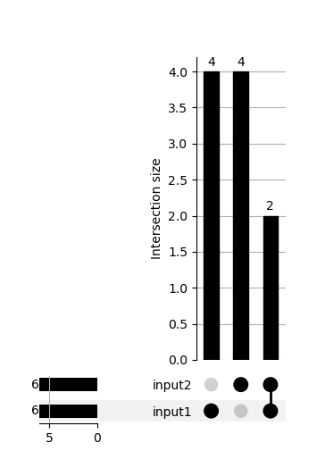

## Utility scripts
### annotation_script.py
Script to add annotation to input callset with respect to specified comparison callsets. Annotations identify
records in the input callset that overlap with records in the comparison callsets. An example call is of the form:
```
python annotation_script.py --output_vcf {path} --source_vcf {path} --comparison_panel {path}
```
The full set of input flags and default values are given here:
```
  --output_vcf OUTPUT_VCF
                        output path for annotated file
  --source_vcf SOURCE_VCF
                        input vcf that will have annotations add to (a copy
                        of) it
  --comparison_panel COMPARISON_PANEL
                        Tab-separated panel file giving label/vcf pairs for
                        the comparison vcfs in each line of the text file
  --overlap_thr OVERLAP_THR
                        Overlap threshold to be applied when looking for
                        overlapping calls of different type
  --overlap_bp_margin OVERLAP_BP_MARGIN
                        breakpoint margin to be applied in determining overlap
                        of two intervals
  --allowed_overlap_type {agnostic,same,different}
                        SV type constraints on what events are considered
                        overlapping: if 'agnostic' then overlaps will be
                        allowed across type; if 'same' then overlaps will
                        require events of the same type; if 'different' then
                        overlaps will require events of different type
```
Panel files should have label/callset names in the first column and paths in the second column (tab separated) as in this example:
```
Sniffles	/athena/ihlab/scratch/vpopic/SVNet/benchmarks/sniffles/CHM/CHM1_CHM13/sniffles_final.vcf
Huddleston	/athena/ihlab/scratch/vpopic/SVNet/benchmarks/datasets/CHM/huddleston_CHM1_CHM13_callsets/CHM1_CHM13_SVs_FINAL.annotated_formatcorrected.vcf
PBSV	/athena/ihlab/scratch/vpopic/SVNet/benchmarks/pbsv/CHM/CHM1_CHM13/pbsv_final.vcf
```

### upset_from_annotations.py
Script to generate upsetplots from vcfs output from SURVIVOR (i.e., include SUPP_VEC value in the info field). Upsetplots
can be stacked or unstacked, but stacked plots will require that the input vcfs have a 'OVERLAP' info field (added by the annotation
script) to create the stacked bars. An example call is of the form:
```
python upset_from_annotations.py --annot_vcf {path to annotated vcf} --output_path {path} --tools {toolname1 toolname2 ...} --plot_type {type}
```
The full set of input flags and default values are given here:
```
  --annot_vcf ANNOT_VCF
                        Comparison-annotated vcf file
  --output_path OUTPUT_PATH
                        Output path for plot
  --tools TOOLS [TOOLS ...]
                        Tool names
  --plot_type {stacked_upset,upset,venn,pseudovenn}
                        Flag to indicate whether to generate an upset or a
                        venn diagram

```

### survivor_merge.sh
Bash script to merge callsets given in an input panel file (first input argument) and path to SURVIVOR executable (second input argument),
and create upsetplot from the SURVIVOR output. Panel files should be in the same tab-separated format is in the case
of annotation_script.py (first column specifying the tool name, second column specifying path to vcf).

### annotation_test
**Annotation and plotting test**
`annotation_test` directory contains example vcf files that can be used and modified to test the functionality of the annotation
and plotting scripts. The files currently uploaded include `survivor_example.vcf`, a subset of a SURVIVOR output vcf called
on a set of eight input tools, `survivor_example_OVLP1.vcf` and `survivor_example_OVLP2.vcf`, two vcfs which overlap the
first four and last four records (respectively) of `survivor_example.vcf`. An example panel file is also included which can
be used to run an example call of the annotation script, `test_panel_OVLP.txt`. The annotation script on these example files
can be run with the following command:
```
python annotation_script.py --output_vcf annotation_test/survivor_example_annot_OVLP.vcf --source_vcf annotation_test/survivor_example.vcf --comparison_panel annotation_test/test_panel_OVLP.txt
```
The output file created by this execution will be a copy of `survivor_example.vcf` but with annotations indicating that the first
four records overlapped with records in `survivor_example_OVLP1.vcf` and that the last four records overlapped with records in
`survivor_example_OVLP2.vcf`.

Because the example vcf included `SUPP_VEC` fields from SURVIVOR, the plotting method can be called in the following way to
generate upsetplots (for this example we will use placeholder tool names to match the number of tools originally given as input
to SURVIVOR):
```
python upset_from_annotations.py --annot_vcf annotation_test/survivor_example_annot_OVLP.vcf --output_path annotation_test/upset.png --tools tool1 tool2 tool3 tool4 tool5 tool6 tool7 tool8 --plot_type upset
```
This will yield the follow upsetplot (the stacked version can be generated by changing the `--plot_type` parameter):
Upset             |  Stacked upset
:-------------------------:|:-------------------------:
 | 

**Bash script/SURVIVOR test**
`annotation_test` also includes versions of the two above comparison vcfs with the `SUPP_VEC` fields removed (`example_OVLP1.vcf`
and `example_OVLP2.vcf`) which can be used to test the SURVIVOR merge call and upsetplotting command executed in the
`survivor_merge.sh` bash script in the following way:
```
sh survivor_merge.sh annotation_test/test_panel_survivor.txt {path to SURVIVOR executable}
```
This command will generate a `merged.vcf` file containing the records representing the union of the records in the input vcfs
specified in `test_panel_survivor.txt`, and it will also generate the following upsetplot:


### build_igv_batch_script.py
Procedure to generate an IGV batch script that can be used for automated screenshotting of different loci. There are three
different modes in which this script can be run which can be specified using the `mode` input field:
- `non_survivor`: input VCF doesn't include SUPP_VEC field and all records will be added to the batch script
- `survivor_single`: input VCF includes SUPP_VEC field and only the records with `SUPP_VEC==args.trg_supp_vec` will be added 
to the batch script - in this mode specifying a target support vector is required
- `survivor_multiple`: input VCF includes SUPP_VEC field and the screenshots from the records with the different SUPP_VEC 
values will be placed in directories named with the corresponding SUPP_VEC binary string
A call to the script may be of the following form:
```
python build_igv_batch_script.py --input_vcf {path} --bam_path {path} --output_dir {path} --mode {non_survivor, survivor_single, survivor_multiple}
```
Information about running a batch script in IGV can be found in the IGV documentation: https://software.broadinstitute.org/software/igv/batch